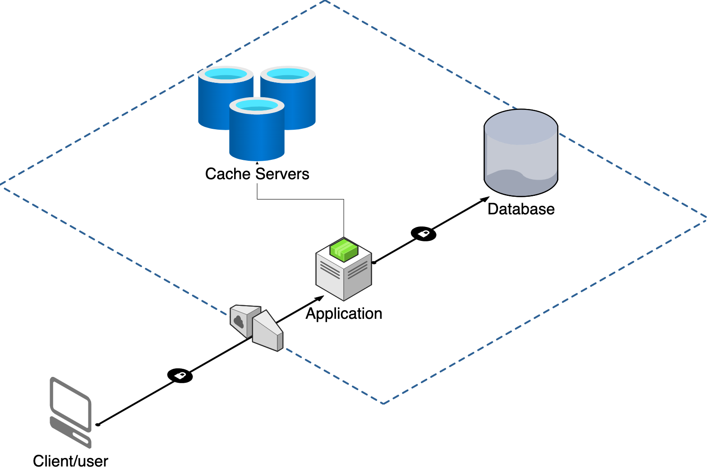

# Architecture

There are a couple of components of the overal architecture that are just as important as the application itself. They are needed for the application to run & function as intended. This document will explain the components and further explain the internals of the architecture of the application.

Below is a diagram with the components at a high level.



## Cache

The application caches redirect requests on shortened urls, preventing a round trip to the database. If there is a cache miss, the application will fetch the url from the database given the short code and redirect the user to the original url, then save this in the cache. Subsequent requests for a given url given a short code will be served from a cache, therefore speeding up these requests.

## Database

The databasee is used to store user information as well as url information. This database is a NoSQL type database as there is no hard relationship between the urls and the user, therefore no need to use a SQL database, however, the choice of the type of database does not matter, as long as we can ensure that no duplicate records exists and we can save urls and user information reliably.

## Application

Then there is the application. The application itself has several components that make it function as intended. There are a couple of middlewares that ensure we can log requests, that requests are authorized and authenticated & we can also monitor performance of requests. Additionally, there are other layers as well. For example, a repository layer that communicates with the database. Cache layer that communicates with the cache service and authentication service that handles authentication and issueing of [JWT](https://jwt.io) tokens. All these are decoupled and allow the application to scale appropriately and as needed.

An example is the repository layer. The underlying database client used is abstracted away from the rest of the application. If there is a need to change how storage is handled, for example, changing from a NoSQL to a SQL type of datastore, then this can be done in one place only and the rest of the application can continue to function as intended.

Similar case applies to Authentication. There is no 3rd party authentication service implemnted, simply a library that handles the JWT tokens. However, if this is ever needed to change. This can easily be done without affecting the overal running of the application.

This follows the [Hexagonal Architecture](https://en.wikipedia.org/wiki/Hexagonal_architecture_(software)) which strongly emphasizes the decoupling of several components to allow for the intent of the application to be clear and precise.

Here is a directory structure of the application:

```plain
app
├── api
│   ├── client
│   │   ├── handlers.go
│   │   └── router.go
│   ├── health
│   │   ├── handlers.go
│   │   └── router.go
│   ├── v1
│   │   ├── auth
│   │   │   ├── dto.go
│   │   │   ├── handlers.go
│   │   │   └── router.go
│   │   └── url
│   │       ├── dto.go
│   │       ├── handlers.go
│   │       ├── mapper.go
│   │       └── router.go
│   └── v2
├── cmd
│   └── main.go
├── config
│   ├── auth.go
│   ├── cache.go
│   ├── config.go
│   ├── database.go
│   ├── logging.go
│   └── monitoring.go
├── internal
│   ├── core
│   │   ├── contracts
│   │   │   ├── repositories.go
│   │   │   └── services.go
│   │   ├── entities
│   │   │   ├── base.go
│   │   │   ├── keyword.go
│   │   │   ├── keyword_test.go
│   │   │   ├── url.go
│   │   │   ├── url_test.go
│   │   │   ├── user.go
│   │   │   ├── user_email.go
│   │   │   ├── user_email_test.go
│   │   │   ├── user_password.go
│   │   │   └── user_token.go
│   │   ├── urlsvc
│   │   │   ├── urlsvc.go
│   │   │   └── urlsvc_test.go
│   │   └── usersvc
│   │       └── user_svc.go
│   ├── repositories
│   │   ├── models
│   │   │   ├── base.go
│   │   │   ├── keyword.go
│   │   │   ├── url.go
│   │   │   └── user.go
│   │   ├── repo.go
│   │   ├── urlrepo
│   │   │   ├── mapper.go
│   │   │   └── url_repo.go
│   │   └── userepo
│   │       ├── mapper.go
│   │       └── user_repo.go
│   └── services
│       ├── auth
│       │   └── auth.go
│       ├── cache
│       │   ├── cache.go
│       │   └── cache_test.go
│       └── notifications
│           ├── email
│           │   └── email_svc.go
│           ├── notification_svc.go
│           ├── push
│           └── sms
├── pkg
│   ├── constants.go
│   ├── encoding
│   │   ├── encoding.go
│   │   └── encoding_test.go
│   ├── errdefs
│   │   └── errors.go
│   ├── identifier
│   │   └── identifier.go
│   ├── jwt
│   │   ├── errors.go
│   │   └── jwt.go
│   ├── utils
│   │   ├── password.go
│   │   ├── password_test.go
│   │   ├── utils.go
│   │   └── utils_test.go
│   ├── validators
│   │   ├── validator.go
│   │   └── validator_test.go
│   └── version.go
├── server
│   ├── middleware
│   │   ├── auth.go
│   │   ├── cors.go
│   │   ├── logger.go
│   │   ├── middleware.go
│   │   ├── monitoring.go
│   │   └── recovery.go
│   ├── router
│   │   ├── local.go
│   │   └── router.go
│   ├── server.go
│   └── utils
└── tools
    ├── env
    │   └── env.go
    ├── logger
    │   ├── app_logger.go
    │   ├── app_logger_test.go
    │   ├── logger.go
    │   ├── logger_test.go
    │   ├── options.go
    │   └── options_test.go
    └── monitoring
        ├── monitoring.go
        └── sentry.go
```

> This directory structure can be found in the [app](../app/) directory and follows closely [Go's](https://github.com/golang-standards/project-layout) recommended project layout

The [internal](../app/internal/) is where the _heart_ or the intent of the application lies.

The [core](../app/internal/core/) package contains use cases and the entities of the application which communicate that it handles urls and users. This makes it clear what it's actual purpose or intent is.

The [repositories](../app//internal/repositories/) package contains the the database layer and is responsible for persistence of records. If there is a change of how storage is handled, this is where the change is done.

The [services](../app/internal/services/) package contains sub packages that handled communication with external services or implementation for communicating with external services or even libraries that handle that kind of functionality. Decoupling them out like this allows for the easy abstraction from the overal application. This is where the [cache](../app/internal/services/cache/), [authentication](../app/internal/services/auth/) & [notifications](../app/internal/services/notifications/) services can be found.

[pkg](../app/pkg) package contains utilities that can be used across any layer. [config](../app/config/) contains configuration code for setting up the application. [api](../app/api) package contains the API layer that handles HTTP communication with external clients.

[tools](../app/tools/) contains tools that are useful for the application but not critical to its functionality. This is where you will find logging and monitoring utilities.

[server](../app/server/) package contains the server or infrastracture code that is used to setup the application to run. This has been setup in a way that allows switching out the underlying framework preventing the proverbial _lock in_.

Finally, the [cmd](../app/cmd/) package contains the entry point of the application where everything is wired up together to form the **Curtz** application.
